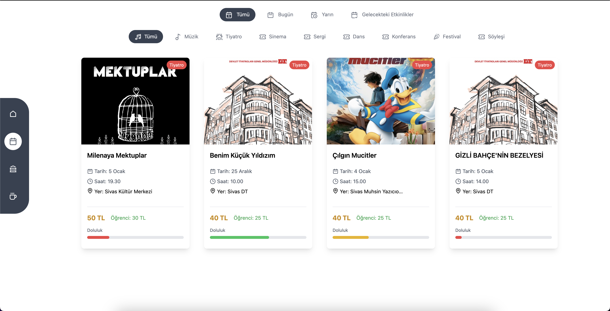
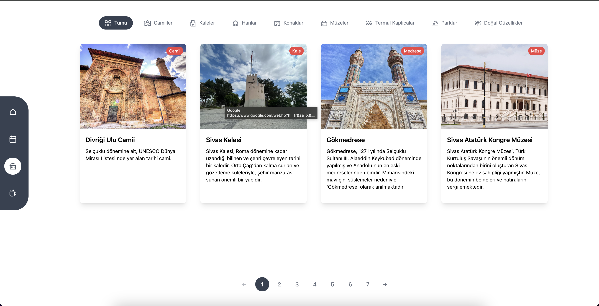

# Sivas Mekan Rehberi

Bu proje, Sivas ilini tanıtmayı amaçlayan bir web arayüzüdür. Proje sayesinde Sivas'taki mekanlar, kafeler, etkinlikler ve diğer önemli yerler hakkında bilgi edinebilirsiniz.

## Özellikler
- Şehirdeki mekanları listeleme
- Kullanıcı dostu bir arayüz
- Güncel etkinlikler hakkında bilgi
- Sivas'ın kültürel ve tarihi yerlerini keşfetme imkanı

## Kurulum

Bu projeyi çalıştırmak için aşağıdaki adımları izleyin:

1. Depoyu klonlayın:
   ```bash
   git clone https://github.com/kullanici/sivas-web.git
   ```

2. Proje dizinine gidin:
   ```bash
   cd sivas-web
   ```

3. Bağımlılıkları yükleyin:
   ```bash
   npm install
   ```

4. Uygulamayı başlatın:
   ```bash
   npm start
   ```

## Kullanım

Projeyi çalıştırdıktan sonra tarayıcınızda [http://localhost:5173](http://localhost:5173) adresini ziyaret ederek uygulamayı görüntüleyebilirsiniz.

## Ekran Görüntüleri

### Anasayfa


### Etkinlikler Sayfası


### Mekanlar Sayfası


## Kullanılan Teknolojiler

- **React**: Kullanıcı arayüzü için
- **Vite**: Hızlı geliştirme ortamı
- **Tailwind CSS**: Modern ve hızlı bir stil kütüphanesi
- **React Icons**: Modern icon kütüphanesi

## Katkıda Bulunma

Projeye katkıda bulunmak isterseniz:
1. Depoyu çekin.
2. Yeni bir branch oluşturun:
   ```bash
   git checkout -b ozellik-adi
   ```
3. Yaptığınız değişiklikleri işleyin ve gönderin.
   ```bash
   git commit -m "Ozellik ekleme"
   git push origin ozellik-adi
   ```
4. Bir "Pull Request" oluşturun.


Bu proje, Sivas'ı keşfetmek isteyenler için ideal bir rehber olmayı hedeflemektedir. Her türlü geri bildirim ve katkılarınızı bekliyoruz!
